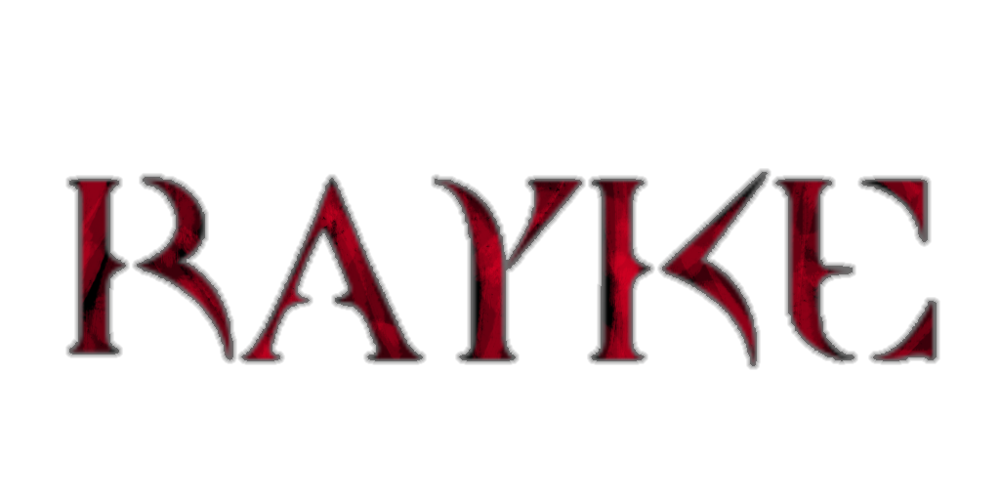

# RAYKE
a quake style drop down console and Jass frontend built with raylib and odin

## Usage

Clone this repo and its submodules into your odin project folder

```
git clone --recurse-submodules https://github.com/shmoich/rayke
```

Import the package

```
import rayke "rayke"
```


## Demo
